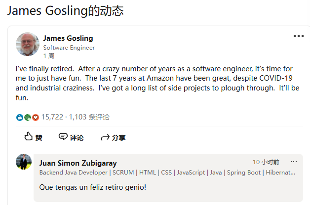
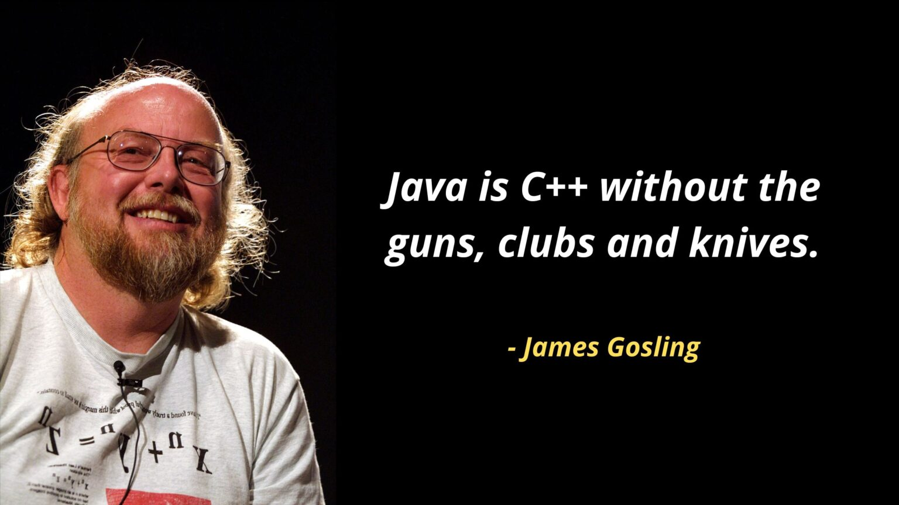
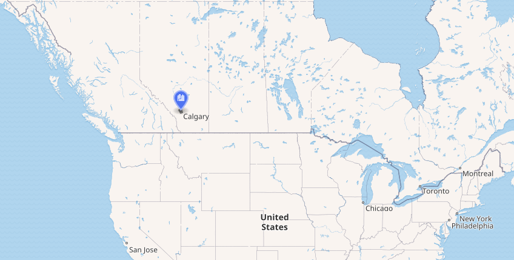
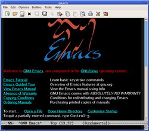
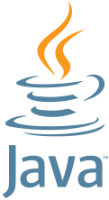
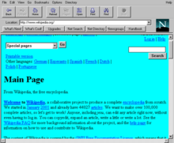
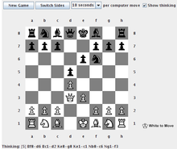

# Java之父高斯林

2024年7月, Gosling 在 领英(Linked In)上发消息, 宣布退休。

>  James Gosling 在领英的动态

不仅让人感叹，至今距离 Java 的推出已经过去了近30年，Java 仍然是编程语言中不可或缺的一份子。下面的博客，让我们回顾java之父高斯林的故事。

> Java is C++ without the guns, clubs and knives. --- James Gosling

## 童年

James A. Gosling, 1955年5月生于加拿大 艾伯塔省 卡尔加里市 （Calgary, Alberta, Canada）

> 卡尔加里, 加拿大中南部的一座城市

 12 岁时，高斯林已能设计电子游戏机，帮邻居修理收割机。

14 岁时，中学组织到附近的卡尔加里大学参观，也就是在这个时候，高斯林首次接触到了编程，并萌发了兴趣。

据悉，一年后，他曾参观的卡尔加里大学招他当了一名临时编程员（兼职），他也成功编写了一些 ISIS II 卫星遥测的地面分析的软件。在双向成就之下，高斯林也进入卡尔加里大学。

## 求学

1977年, James Gosling 在卡尔加里大学获得计算机学士学位. 

1983, 在卡耐基梅隆大学获得博士学位

他的博士论文名为《约束满足问题中的代数操作》"The Algebraic Manipulation of Constraints". 

值得注意的是，他的博士论文指导老师是《编程珠玑》的作者Jon Bentley

攻读博士学位期间，高斯林还开发了一款 Gosling Emacs 编辑器，这也是第一个在 Unix 上运行的类似 Emacs 的编辑器，它是用 C 语言编写的，并使用 Mocklisp 作为扩展语言，这是一种具有 Lisp 类似语法的语言。

>  EMACS

在卡内基梅隆大学（CMU）期间，他的一项重要工作是将 UCSD Pascal p-code 从 PERQ 工作站移植到 DEC VAX 计算机系统上，为此他编写了一个 VAX 仿真器。在后来参与 Sun Java 项目时，高斯林将这段早期工作作为灵感，提出了 Java 虚拟机的概念，这种虚拟机允许代码一次编写即可在多个平台上运行，使程序员始终针对同一个虚拟机编写代码。这当然都是后面发生的事情了。

## 工作

高斯林正式毕业之后，便加入 IBM 工作，设计并实现了 Andrew 窗口系统（第一个分布式窗口系统）和 Andrew 用户界面工具包（第一个基于文档的面向对象工具包）。此后，也为 IBM 的 PC/RT 产品提供咨询。

不过，有消息称，这一阶段的高斯林所做的工作并未得到公司领导层的重视，对于这段经历，高斯林也在他的领英上还有些遗憾地写道，“要是 IBM 听了我的意见就好了！！”

所以毕业在 IBM 干了不到两年后，高斯林跳槽到了虽说是初创公司，但已经成立十年的 Sun Microsystems，开启了 Java 的辉煌时代。

## 开发一款新语言

属于 Java 的故事始于高斯林加入 Sun 公司的 5 个月后即 1991 年 6 月展开。

> Sun microsystems 一个虽已不复存在，但仍然伟大的公司

当时 Sun Microsystems 的一小队工程师在高斯林的带领下启动了一个名为 Green（绿色计划）的项目。这个项目的目标是开发一种用于消费电子设备（如智能电视、机顶盒和手持控制器）的编程语言。这些设备需要一种简单、强大、可移植且安全的语言，因为它们的内存和处理能力有限，并且必须通过不同的网络相互通信。

起初，该团队将该语言命名为 Greentalk，文件扩展名为 .gt。后来，他们将其重新命名为 Oak，以纪念高斯林办公室外的一棵橡树。Oak 受到了其他几种语言的影响，例如 C、C++、Smalltalk、Lisp 和 Ada。

## java 和 Web

然而，Oak 并非为 Web 设计的，当时 Web 正成为一种分布式计算和信息共享的新平台。

1993 年，Green 团队向时代华纳（Time Warner，当时最大的媒体与娱乐公司）展示了他们的技术，时代华纳对将其用于互动电视很感兴趣。然而，有线电视行业尚未准备好接受如此先进的系统，最终交易未能达成。于是，团队将注意力转向了 Web 时代，认为这为他们的语言提供了更有前景的机会。

团队意识到，Oak 可以用于创建动态和互动的网页，这些网页可以在支持 JVM 的任何浏览器上运行。他们创建了一个名为 WebRunner 的原型浏览器，后来更名为 HotJava，它可以执行嵌入在 HTML 页面中的 Oak applet（小程序）。由于已经有另一种语言名为 Oak，他们决定将 Oak 更名为 Java。选择 Java 这个名字是因为它简单、独特、有趣，而且让人联想到咖啡，团队在长时间工作中消耗了大量的咖啡。所以Java图标上，也有一杯冒着热气的咖啡。如下图

> 冒着热气的 Java 图标

1994 年底，高斯林在硅谷召开的“技术、教育和设计大会”上首次展示了 Java 程序。

同年，网景公司社区( Netscape Communications) 同意在其流行的 Netscape Navigator 浏览器中加入对 Java 的支持。这大大提升了 Java 的知名度和曝光率，因为数百万的网络用户可以在他们的浏览器上访问 Java applet。

>  互联网浪潮的弄潮儿 Netscape 网景公司

>  功能丰富的 Netscape Navigator 浏览器

>  java applet 制作的小游戏

当时，时代杂志将 Java 评为 1995 年十大最佳产品之一。

自 1995 年首次发布以来，Java 经历了许多变化和改进。Sun Microsystems 于 1998 年成立了 Java 社区进程 (JCP)，以允许其他公司和组织参与 Java 的开发和标准化。JCP 负责监督 Java 规范的创建和修订，这些规范定义了该语言的语法和语义以及其库和 API（应用程序编程接口）。

如今 Java 历经近 30 年的迭代，成为开发者最常用的编程语言之一。而高斯林作为 Java 编程语言的共同创始人之一，也被公认为“Java 之父”。

# Java 语言

Java 是一门面向对象的语言 （OOP: Object-Oriented programming）

>  一次编写,处处执行 (write once, run anywhere  )

这句名言来自 Java, 指的是同一套 Java 代码可以不经过修改，也无需重新编译，就运行在不同的平台系统上。

为什么java可以做到在

Java介于编译型语言和解释型语言之间。编译型语言如C、C++，代码是直接编译成机器码执行，但是不同的平台（x86、ARM等）CPU的指令集不同，因此，需要编译出每一种平台的对应机器码。

而Java是将代码编译成一种“字节码”，它类似于抽象的CPU指令，然后，针对不同平台编写虚拟机，不同平台的虚拟机负责加载字节码并执行，这样就实现了“一次编写，到处运行”的效果。
