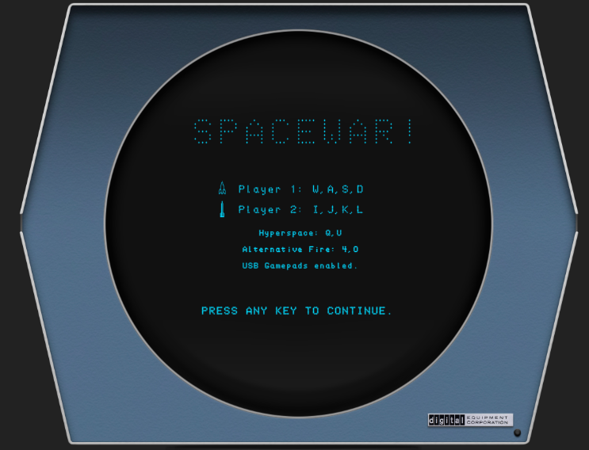
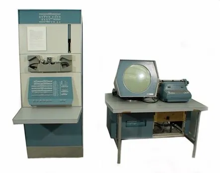
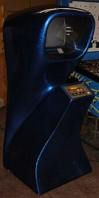
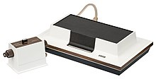
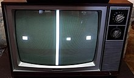
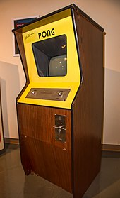
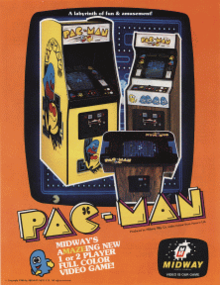
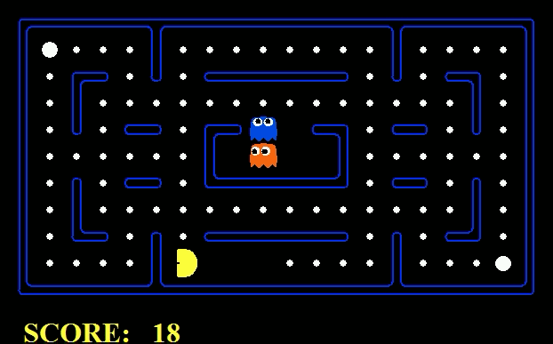

# 电子游戏历史(早期)

## 第一款电脑游戏-来自大学的SpaceWar!

### SpaceWar! 

SpaceWar! 是一款太空战斗电子游戏，1962年，以Steve Russell为首的一群哈佛员工和麻省理工学院的学生创建了Spacewar！它是在麻省理工学院新安装的DEC PDP-1小型机上编写的。

游戏玩法是太空混战的两人实时模拟。与之前的电脑游戏不同，太空战争将玩家带入了一个紧张的虚拟游戏世界，其强度远远超过了之前的跳棋、台球、棒球、井字游戏或其他游戏。

尽管SpaceWar有商业潜力，但没有人从中赚到一分钱！这在很大程度上是由于游戏最重要的功能——它的便携性，它需要一款PDP-1小型机才能运行。于是秉持着黑客精神和学术精神，Russell等人就将代码开源了，任何拥有PDP-1和一些编程技能的人都可以对其进行改编。SpaceWar! 就像野火一样蔓延开来，激励着大批新程序员继续突破计算机编程的界限。后人将其称之为 “ 第一届银河系间太空战争奥运会 ”，这甚至可以被视为现代电子游戏锦标赛的先驱。

​                                                                              *SpaceWar!的游戏界面*

《SpaceWar！》，也是后来了世界上第一款投币游戏《Galaxy》和第一款大规模生产的电子游戏《ComputerSpace》的基础。

你现在也可以在网上玩到 SpaceWar! 的网页版

[Spacewar! (masswerk.at)](https://www.masswerk.at/spacewar/)

### 银河游戏 Galaxy War

在斯坦福大学，学生Bill Pitts和Hugh Tuck使用PDP-11主机构建了《银河游戏》的两个原型，他们从1971年11月开始在该大学进行演示，但未能将其转化为商业游戏。但这也成了第一款投币游戏。

## 从SpaceWar到ComputerSpace

20世纪60年代，其实在MIT、斯坦福之类的大学里就已经出现了电子游戏。比如《太空战争》, 它运行在PDP小型机上。然而一台 PDP-1的定价为12万美元（相当于2023年的90.3万美元），《太空战争》或当时的任何游戏，由于运行在价格高昂的小型机设备上，所以难以走出狭窄的大学圈子，难以大众化商业化。

​                                                                       *价格昂贵的小型机*

到1970年左右，斯坦福大学学生会出现了一种投币式版本的 SpaceWar! 。一位同事邀请 诺兰·布什内尔(Nolan Bushnell ) 去看在斯坦福大学的PDP-6计算机上运行的太空战争游戏。bushnell 感觉游戏很有趣，但是PDP-6这样的计算机的昂贵价格让他望而却步。Bushnell萌生了在一台较小的计算机上重现游戏的想法，他想制作一个街机版的《 SpaceWar! 》，他给游戏取名为《ComputerSpace》。在《ComputerSpace》中，你扮演一艘火箭船，在星场周围飞行，同时发射子弹攻击外星人的飞碟，每击中一次你的得分都会增高。

​                                                                   价格实惠的ComputerSpace硬件设备

他们一开始尝试用通用计算机Data General Nova上运行游戏，一台Data General Nove可以连接若干终端屏幕。但他们很快发现，花费几千美元的通用计算机，最多只能在若干台终端上运行 ComputerSpace 游戏，其盈利能力不值一提。但如果可以设计一台专门为运行一款游戏的硬件电路，并把成本控制到100美元以内，那将有极大的盈利空间。

最终他们使用TTL逻辑芯片来控制游戏。游戏不是在计算机上运行的软件程序，而是完全作为在电视屏幕上移动点的硬件实现（以有限状态机的形式）存在。1971年8月，他们在斯坦福附近的一家酒吧展示了他们的样机，并找到了制造商为他们制造游戏机。1971年10月15日，ComputerSpace 在芝加哥举行的美国音乐运营商展上首次公开亮相。这款游戏采用了多种颜色的引人注目的玻璃纤维机身，通常带有闪闪发光的表面。第二年，布什内尔和达布尼创立了雅达利，并出售了大受欢迎的街机游戏《Pong》。《Computer》并没有《Pong》那么成功，但它的销量估计为500到1000台，与当时一款相当成功的机电街机游戏不相上下。《Computer Space》为Atari的创建提供了跳板，Atari在1970年代和1980年代初期成为了一个极具影响力的文化和商业现象。

## 第一款家用游戏机

在第一款街机《Computer Space》发布时，拉夫贝尔 (Ralph H. Baer)正在开发第一款家用游戏机 Odyssey。

家用电子游戏机的想法是拉夫贝尔在1966年8月提出的，他回忆到：当时家用电视机的价格下降，打开了一个巨大的潜在市场，他想到可以利用电视屏幕开发游戏用于家庭娱乐。

在接下来的三年里，他与比尔·哈里森和比尔·鲁施一起，经过不断试错，连续创建了七个原型机。直到第七个原型机才初步定型，他们将机器取名为麦格纳沃克斯-奥德赛（后文都简称奥德赛）。 奥德赛名字来自古希腊史诗《奥德赛》，象征着游戏开发过程中冒险、探索和克服困难的精神。

​                                                                               *奥德赛家用游戏机*

奥德赛游戏机附带的28款游戏中，有一款是乒乓球游戏，有趣的是，Atari的第一款游戏《Pong》，直接从奥德赛上的乒乓球游戏中获得了灵感。该游戏能够在电视屏幕上显示三个方形点和一条垂直线。其中两个点由两个玩家控制，第三个点由系统本身控制。主控制台有两个表盘，其中一个在屏幕上移动垂直线，另一个调节计算机控制的点的速度。

​                                                                      *在电视屏幕上玩乒乓球游戏*

在1971年1月奥德赛正式生产之前，已经向几家制造商展示过。在通过经销商发布后，第一年就大卖，售出了6.9万台奥德赛游戏机；到1975年机器停产时，总共售出了35万台。奥德赛的发布标志着第一代视频游戏机的开始，也是商业视频游戏行业崛起的早期部分。贝尔也因此被认为是“家用游戏机之父”。

## 雅达利的诞生

布什内尔的上一款街机游戏《ComputerSpace》是对原版的翻拍，许多顾客觉得玩起来觉得很一般。布什内尔在他的下一款游戏《Pong》中获得了更好的成功，该游戏引发了一场街机革命。

布什纳尔在Magnavox Odyssey上看到乒乓球游戏的演示后，萌生了下一款游戏的想法。Bushnell和Dabney决定独立经营，他们离开了Nutting，将公司改革为Atari股份有限公司，并聘请Allan Alcorn帮助设计一款基于奥德赛游戏的街机游戏。Pong于1972年11月首次限量发行，并于1973年3月进行了更广泛的发行。Pong非常成功，每台机器每天的收入超过40美元，远远超过当时大多数其他投币式机器。

​                                                                                    *PONG 街机*

## 街机游戏的黄金时代

电子游戏的早期历史离不开街机游戏,也就是在酒吧/咖啡厅/电玩城里的投币式互动游戏机。

从70年代末到80年代初, 是街机电子游戏的黄金时代，涌现了诸如 Pong, 太空入侵者, 吃豆人 之类的著名游戏

### Tank

Tank是一款街机游戏，由雅达利旗下的Kee Games开发，于1974年11月发行。

在游戏中，两名玩家驾驶坦克穿过一个从上方看去的迷宫，同时试图向对方射击，并避开中央雷区的地雷（用X标记表示）。每个玩家都用一对操纵杆控制他们的坦克，前后移动它们以驾驶、倒车和转向，并用按钮发射炮弹试图摧毁另一辆坦克。地雷或炮弹摧毁坦克可为对方赢得一分，坦克被摧毁后会重新出现。获胜者是在时间耗尽时获得更多分数的玩家，每场比赛通常持续一到两分钟。

.jpg)

### 太空入侵者 Space Invaders

发布公司：Taito 

作者：西角有宏(Tomohiro Nishikado)

玩家在躲避敌人攻击的同时，通过按键释放导弹来攻击敌机，而击杀敌人可以换来响应的积分累计

1. 以分数的形式鼓励玩家间的竞争；

2. 受到敌人攻击即判定失败，游戏同时结束；

3. CPU扮演的敌人会瞄准玩家进行攻击。

### 吃豆人 Pac-Man

发行商：南梦宫 namco

吃豆人游戏里，玩家操作一个名为 Pac-Man 的小黄人在迷宫里穿梭。游戏目标是吃掉迷宫里的所有豆子，同时要躲避4个幽灵的追击。四个幽灵的名字和颜色，分别是 Blinky红色, Pinky粉色, Inky青色, Clyde橙色

当Pac-Man吃掉所有豆子后，就会进入下一关。 如果被幽灵抓住了， Pac-Man 就会失去一条命，3条命耗尽则游戏结束。

Pac-Man 是第一款有角色设计的游戏，黄色的大嘴巴小人 Pac-Man 也成为了家喻户晓的角色。

Pac-Man 也是第一款引入了正真意义上游戏 AI 的游戏。四个幽灵的行为模式各不相同：红色 Blinky 会一直追着 Pac-Man; 粉色 Pinky 和青色 Inky 会跑到 Pac-Man 前面堵他去路, 橙色 Clyde 属于是气氛组，会远离 Pac-Man 移动。

*Pac-Man 游戏动态画面*

Pac-Man 还设计了简单的道具系统，在迷宫的四个角落会有“大力丸”，Pac-Man 吃到大力丸以后,会持续一段无敌时间。在无敌时间内，幽灵变成蓝白色，这时候 Pac-Man 就可以去吃他们，每吃一个都会增加分数。

这里还有一个在线免费游玩的网址：https://freepacman.org/

Pac-Man 的角色设计、AI设计、道具设计，都给未来的游戏开创了新的设计模式。
